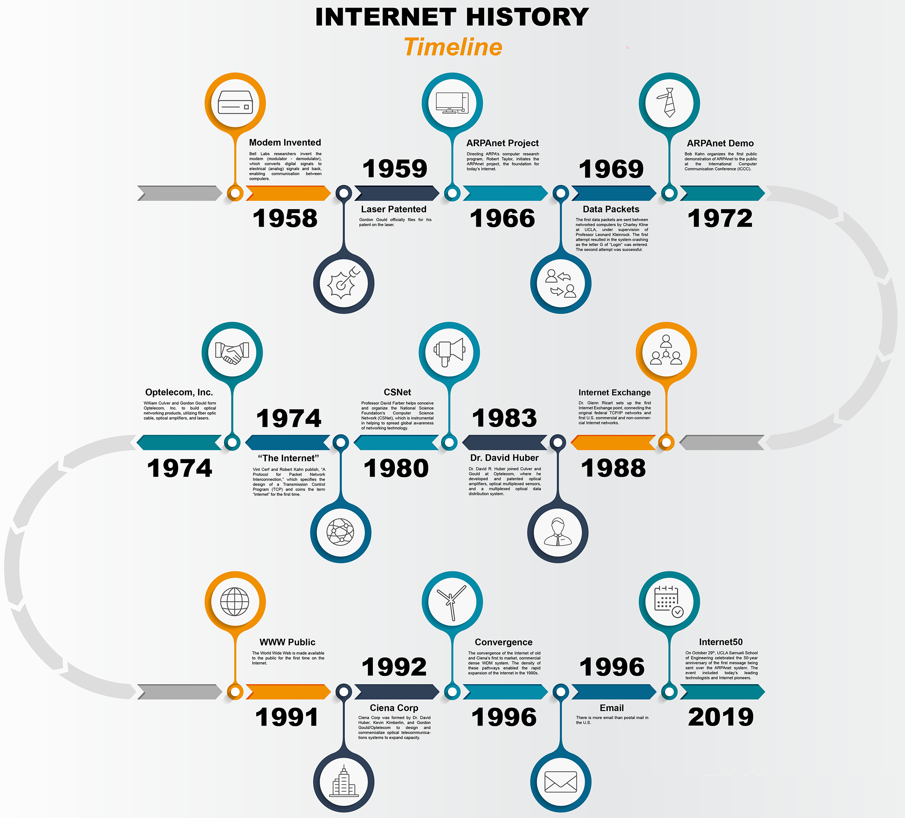

# Web Development History



Web Development History is a webpage that provides a comprehensive overview of the evolution of web development from its early beginnings to the latest modern technologies. Users can navigate through different eras and learn about significant milestones in the development of the web.

## Table of Contents
- [About](#about)
- [Getting Started](#getting-started)
- [Usage](#usage)
- [Contributing](#contributing)
- [License](#license)

## About

This project was created to educate and inform individuals interested in the history of web development. It covers various eras, including the birth of the web, the dot-com boom, the rise of web standards, the Web 2.0 era, the mobile web, and modern web technologies. Additionally, it highlights the importance of web accessibility and security throughout the history of the web.

## Getting Started

To view the webpage locally or deploy it, follow these steps:

1. Clone this repository to your local machine:

   ```bash
   git clone https://github.com/your-username/web-development-history.git

2. Open the project directory:
   ```bash
   cd web-development-history

3. Open the index.html file in your web browser to start exploring the web development history.

## Usage

1. Click on the links in the navigation menu to access detailed information about specific eras in web development.
2. Each era has its own HTML content file (e.g., content-birth.html, content-dotcom.html) for detailed explanations.
3. JavaScript is used to load content dynamically when you click on a navigation link.
4. The project is styled using CSS to provide a clean and readable layout.

## Contributing

If you'd like to contribute to this project, please follow these guidelines:

1. Fork the repository.
2. Create a new branch for your feature: git checkout -b feature-name
3. Make your changes and commit them: git commit -m 'Add feature'
4. Push your changes to your fork: git push origin feature-name
5. Create a pull request from your fork to the main repository.
6. Please ensure your code follows the project's coding standards and conventions.

## License
1. This project is licensed under the MIT License. See the LICENSE file for details.

